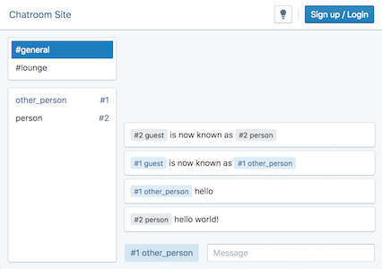
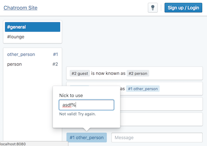
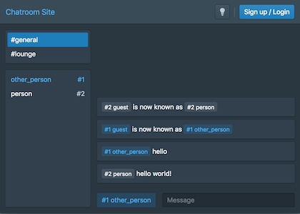

# Chatroom using modern libraries

This project was bootstrapped with [create-react-app-typescript](https://github.com/wmonk/create-react-app-typescript).

The purpose of this is to see how to use modern web libraries together in a single, cohesive web app. Sometimes it's more helpful to see real world examples, because those are the places we run into questions about design or architecture choices.

## Libraries

- [TypeScript](https://www.typescriptlang.org/)
- [React.js](https://reactjs.org/)
- [Blueprint.js](http://blueprintjs.com/)
- [Socket.io](https://socket.io/)
- [React Router](https://reacttraining.com/react-router/)
- [Styled Components](https://www.styled-components.com/)
- [Normalize.css](https://necolas.github.io/normalize.css/)
- [OpenID Connect (Login with Google)](https://www.npmjs.com/package/openid-client)
- [TSLint](https://github.com/palantir/tslint)

I also have [an example](server/global.d.ts) of how to add missing type definitions for libraries that don't already have any.

## Run

Server:

    $ npm install
    $ npm tsc
    $ node dist/index.js

Client:

    $ npm install
    $ npm start

## Visuals

